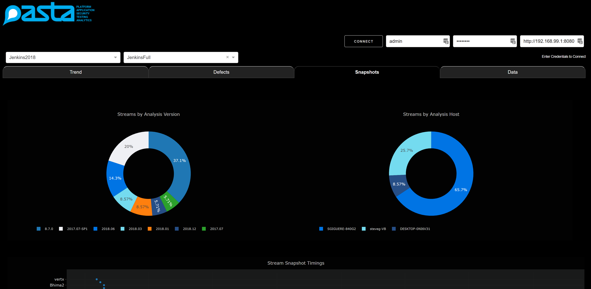

# PASTA

A great acronym for the Platform Application Security Testing Analytics... or a big dashboard to add reporting not currently available in Coverity

## Getting Started

Just git clone the repo...

See the section below on prerequisites but at a minimum you'll need python 3 installed.

Run python3 app.py

### Prerequisites

Install python3.6 or greater
Run a pip install -r /requirements.txt to get everything you need

### Installing

Run python3 app.py

Or 
docker build -t python-pasta .
docker run -p 8050:8050 python-pasta

I run this on a linux VM and then map 8050 to my Windows OS

### What is currently bad about it

Plenty.

On the first run it builds a local database.  This takes a bit.  Maybe 5minutes for a small SE database but would be intolerable for a big one.  I'm looking at adding a thread to populate in reverse order the database so it because usable almost immediately based on the most recent data.

What's worse about the above is that it doesn't tell you it's doing things.  I need some kind of a status bar or... something to day it's the first run, be patient while it initialises.  I'm adding these to the issues list as they come up so I don't forget. 

## Built With

* [Plotly](https://plot.ly/products/dash//) - A sexy way to create a React dashboard using server side python

## Versioning

Working on this

## Authors

* **Steve Giguere** - *Initial work* 

## License

This project is licensed under the MIT License so far - see the [LICENSE.md](LICENSE.md) file for details once I add that.  Ideally I like to transition this to a Synopsys github or gitlab repo for customers to have.

